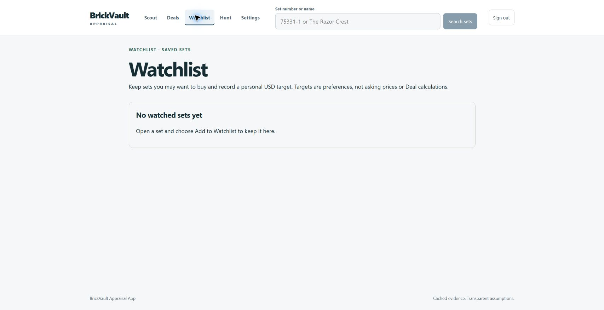
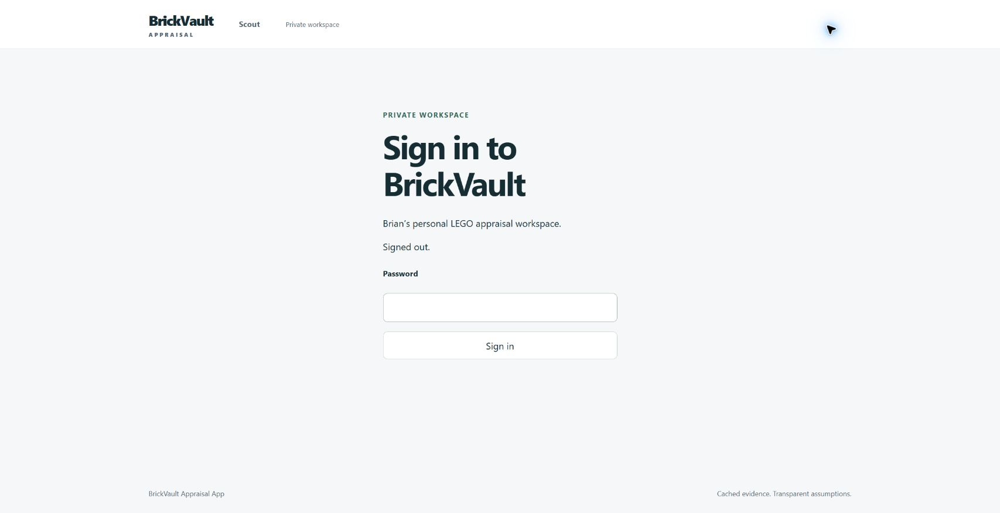

# Cleanup and logout

After the Gate 5 stop, necessary Windows acceptance cleanup passed:

- Original Settings defaults and default profile restored exactly through UI;
  the revision advanced normally rather than being reset.
- Only the exact newly created Watchlist item removed using its current revision
  and authenticated CSRF/Origin API. DELETE 204; authoritative list count zero.
- Browser Sign out completed; old session replay returned 401/no-store.
- Auth cookies were absent; login UI contained no temporary target/note/private
  Watchlist data. No Android session was created.

**Residual:** the ordinary calculation inserted one UNSAVED/PENDING forecast
capture. It was not saved or deleted. Existing forecast_guard rejects deletion
before save-eligibility expiry; forecast_cleanup removes expired unsaved rows
when a later normal preview invokes it. Logout/read/list do not invoke cleanup.
No clock manipulation, trigger bypass, raw database deletion, extra calculation,
purge or source change was performed. Complete temporary-data absence and full
Gate 10 acceptance therefore remain unqualified. This residual must be handled
under the normal contract in the separately authorized continuation.
