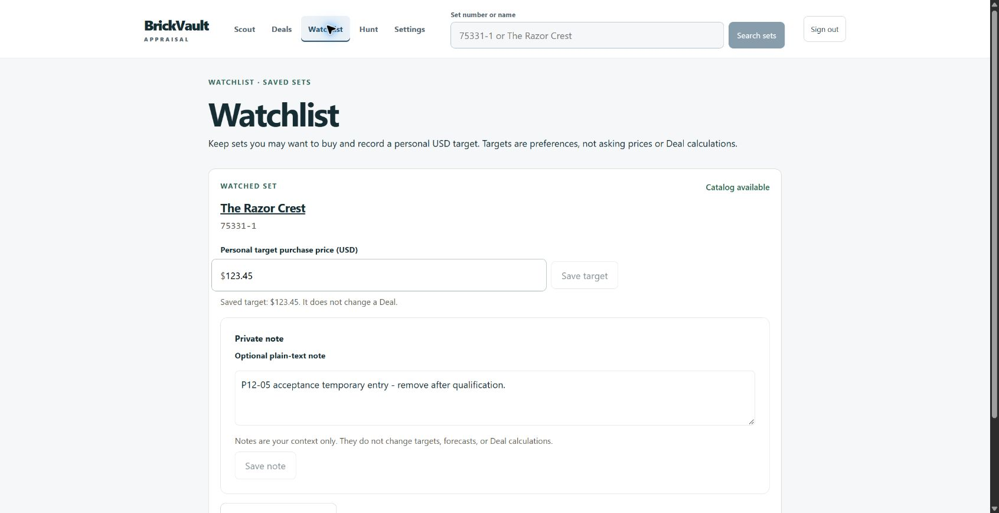

# Windows browser acceptance

Live trusted production Chrome, real owner authentication, no fixture API.
Shell/navigation, exact `75331-1` search, name `Razor Crest` search (six matches),
Set Detail, Deal form, Settings read and Watchlist read passed. Market evidence
remained honestly unavailable with unknown prices. No provider refresh was started.

Settings began with no default profile and choose-in-each-draft sale mode; purchase
limits and both targets were off. MANUAL sale default saved through the UI and
persisted after navigation/full reload. Cleanup restored all original default
values and default profile; revision advanced through normal saves.

Watchlist was initially empty. `75331-1` was added once, target updated to 123.45,
and note set to `P12-05 acceptance temporary entry - remove after qualification.`
Both values survived full reload and leaving/returning through Deals. The
authoritative list contained exactly one item, with no duplicate. Only the new
item was removed afterward; the list returned empty.

The full manual Deal calculation is blocked at Gate 5; form availability does
not substitute for successful economics. [Exact result](manual-economics-blocker.md).
No saved forecast or market-provider activation was requested or performed.
